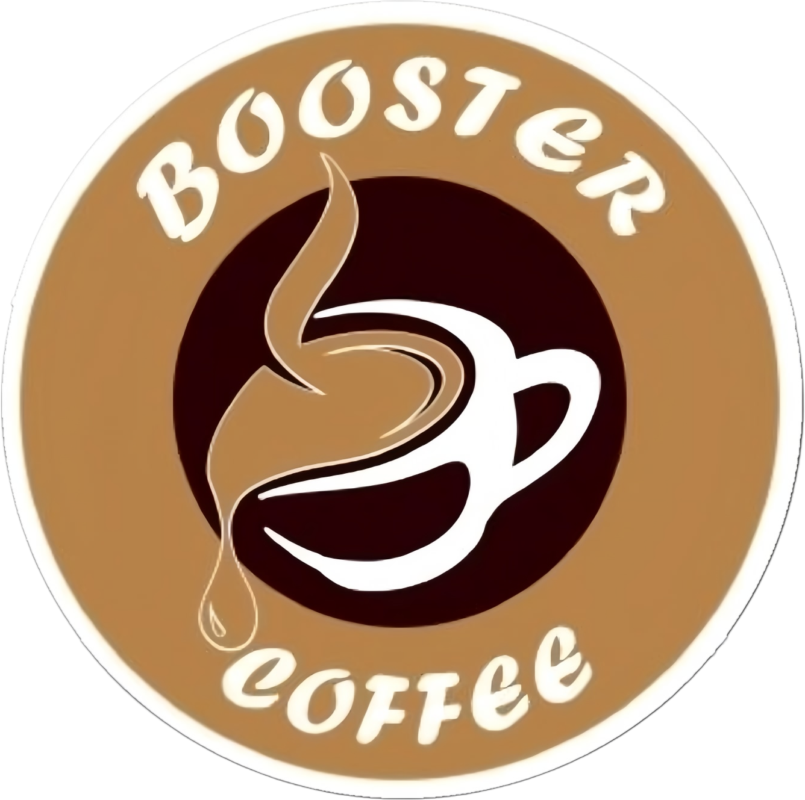

<div align="center">



# ☕ Booster Coffee POS

**Sistem Point of Sale modern untuk coffee shop & warkop**
Dibangun dengan Laravel 13, Livewire Volt, dan Tailwind CSS v4

[](https://laravel.com)
[](https://livewire.laravel.com)
[](https://tailwindcss.com)
[](https://php.net)
[](https://mysql.com)

</div>

---

## ✨ Fitur Utama

| # | Fitur | Deskripsi |
|---|---|---|
| 1 | 🪑 **Manajemen Meja** | Visual denah meja dengan drag-and-drop, 4 status meja |
| 2 | 🛒 **Digital Ordering** | Input pesanan per meja dengan catatan khusus per item |
| 3 | 👨‍🍳 **Kitchen Display System** | Layar dapur real-time, auto-refresh setiap 2 detik |
| 4 | 💳 **Pembayaran & Split Bill** | Tunai, Transfer, QRIS, Split Bill multi-pembayar |
| 5 | 📋 **Manajemen Menu** | CRUD menu dengan foto, kategori, dan status ketersediaan |
| 6 | 🎁 **Promo & Diskon** | Diskon persen, nominal, Buy 1 Get 1, diskon member |
| 7 | 📊 **Laporan Real-time** | Dashboard dengan Chart.js, filter hari/minggu/bulan |
| 8 | 📅 **Reservasi Online** | Form reservasi publik tanpa login + manajemen DP |
| 9 | 🧂 **Manajemen Stok** | Stok otomatis berkurang, notifikasi stok menipis |

---

## 🎨 Tech Stack

```
Backend   : Laravel 13 + Livewire Volt 3
Frontend  : Tailwind CSS v4 + Alpine.js + Chart.js + SortableJS
Realtime  : Laravel Reverb (WebSocket)
Database  : MySQL 8.0.39
Auth      : Laravel Breeze
Role      : Spatie Laravel Permission
Storage   : Laravel Local Disk
```

---

## 👥 Role & Akses

| Role | Akses |
|---|---|
| **Admin/Owner** | Semua fitur — dashboard, laporan, menu, promo, stok, reservasi |
| **Kasir** | Manajemen meja, pesanan, pembayaran |
| **Staf Dapur** | Kitchen Display System (KDS) |

---

## 📁 Struktur Project

```
booster-coffee/
├── app/
│   ├── Http/Middleware/     # RoleMiddleware
│   └── Models/              # Table, Menu, Order, Payment, dll
├── database/
│   ├── migrations/          # Semua migration tabel
│   └── seeders/             # RoleSeeder, TableSeeder, MenuSeeder
├── resources/
│   ├── css/app.css          # Tailwind v4 + custom brand colors
│   ├── js/app.js            # Chart.js + SortableJS
│   └── views/
│       ├── livewire/        # Semua Volt components
│       ├── layouts/         # Layout utama & KDS
│       └── pages/           # Halaman per fitur
└── routes/
    └── web.php              # Route dengan middleware role
```

---

## 🔄 Alur Kerja Singkat

```
Pelanggan datang
      ↓
Kasir update status meja → Terisi
      ↓
Kasir input pesanan per meja
      ↓
Kasir proses pembayaran (Tunai/Transfer/QRIS/Split)
      ↓
Pesanan otomatis masuk ke KDS Dapur
      ↓
Dapur proses & selesaikan pesanan
      ↓
Kasir update meja → Perlu Dibersihkan → Tersedia
```

---

## 📦 Package yang Digunakan

| Package | Versi | Fungsi |
|---|---|---|
| `livewire/volt` | ^1.10 | Single-file Livewire components |
| `spatie/laravel-permission` | ^6 | Role & permission management |
| `spatie/laravel-medialibrary` | ^11 | Upload & manajemen foto |
| `laravel/reverb` | ^1.10 | WebSocket untuk realtime |
| `barryvdh/laravel-dompdf` | ^3.1 | Export laporan PDF |
| `maatwebsite/excel` | ^3.1 | Export laporan Excel |
| `barryvdh/laravel-debugbar` | ^4.2 | Debug tools (dev only) |

---

## 📄 Lisensi

Project ini dibuat untuk keperluan internal **Booster Coffee**.
Dikembangkan dengan ❤️ menggunakan Laravel ekosistem.

---

<div align="center">

**Booster Coffee** · Jl. Srengseng Raya No.85 Kembangan, Jakarta Barat 11630

📸 [@boostercoffeejkt](https://instagram.com/boostercoffeejkt) · 📱 0851-8312-3932

</div>
